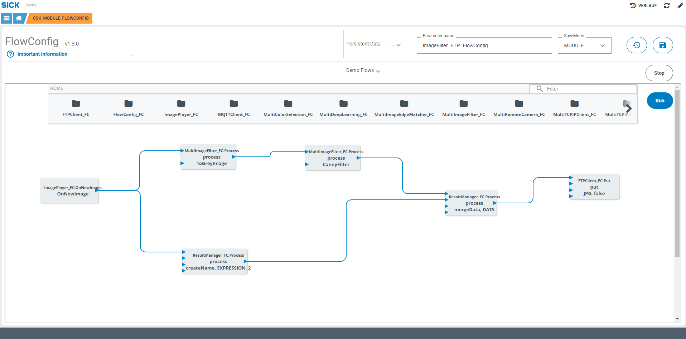

# CSK_Module_FlowConfig

Module to provide the possibility to link input / output data of CSK modules in a graphical way (FlowConfig).  

## How to Run

For further information check out the [documentation](https://raw.githack.com/SICKAppSpaceCodingStarterKit/CSK_Module_FlowConfig/main/docu/CSK_Module_FlowConfig.html) in the folder "docu".

### Dependencies

|Module|Version|Remark|
|--|--|--|
|CSK_Module_Commands|[>=V1.0.0](https://github.com/SICKAppSpaceCodingStarterKit/CSK_Module_Commands)|Necessary to load DemoFlows|
|CSK_Module_RecipeManager|[>=V1.0.0](https://github.com/SICKAppSpaceCodingStarterKit/CSK_Module_RecipeManager)|Necessary to load DemoFlows|
|CSK_Module_PersistentData|[>=V4.1.0](https://github.com/SICKAppSpaceCodingStarterKit/CSK_Module_PersistentData)|Necessary to load DemoFlows|

To run provided demo flows, following modules are needed on the device as well:

|Module|Version|
|--|--|
|CSK_Module_ImagePlayer|[>=V3.0.0](https://github.com/SICKAppSpaceCodingStarterKit/CSK_Module_ImagePlayer)|
|CSK_Module_FTPClient|[>=V4.0.0](https://github.com/SICKAppSpaceCodingStarterKit/CSK_Module_FTPClient)|
|CSK_Module_MultiColorSelection|[>=V3.0.0](https://github.com/SICKAppSpaceCodingStarterKit/CSK_Module_MultiColorSelection)|
|CSK_Module_MultiDeepLearning|[>=V5.0.0](https://github.com/SICKAppSpaceCodingStarterKit/CSK_Module_MultiDeepLearning)|
|CSK_Module_MultiImageEdgeMatcher|[>=V2.0.0](https://github.com/SICKAppSpaceCodingStarterKit/CSK_Module_MultiImageEdgeMatcher)|
|CSK_Module_MultiImageFilter|[>=V2.0.0](https://github.com/SICKAppSpaceCodingStarterKit/CSK_Module_MultiImageFilter)|
|CSK_Module_MultiTCPIPClient|[>=V2.0.0](https://github.com/SICKAppSpaceCodingStarterKit/CSK_Module_MultiTCPIPClient)|
|CSK_Module_ResultManager|[>=V2.0.0](https://github.com/SICKAppSpaceCodingStarterKit/CSK_Module_ResultManager)|

## Information

**INFO for developers**  
UI sources are not included in this repository.  

Tested on:
|Device|Firmware|Module version|
|--|--|--|
|SIM300|V1.1.0|V2.0.0|
|SIM300|V1.1.0|V1.4.0|
|SIM300|V1.1.0|V1.3.1|
|SIM1012|V2.4.2|V1.3.0|
|SIM1012|V2.4.2|V1.0.0|
|SICK AppEngine|V1.8.0|V2.0.0|
|SICK AppEngine|V1.7.0|V1.3.0|
|SICK AppEngine|V1.7.0|V1.0.0|

This module is part of the SICK AppSpace Coding Starter Kit developing approach.  
It is programmed in an object oriented way. Some of the modules use kind of "classes" in Lua to make it possible to reuse code / classes in other projects.  
In general it is not neccessary to code this way, but the architecture of this app can serve as a sample to be used especially for bigger projects and to make it easier to share code.  
Please check the [documentation](https://github.com/SICKAppSpaceCodingStarterKit/.github/blob/main/docu/SICKAppSpaceCodingStarterKit_Documentation.md) of CSK for further information.  

## Topics

Coding Starter Kit, CSK, Module, SICK-AppSpace, Flow, Configuration, No Code, Low Code
